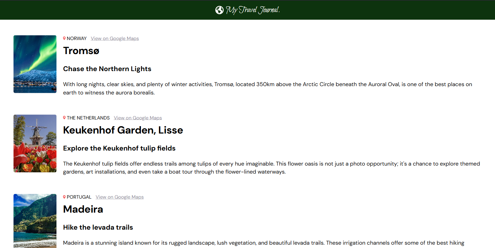
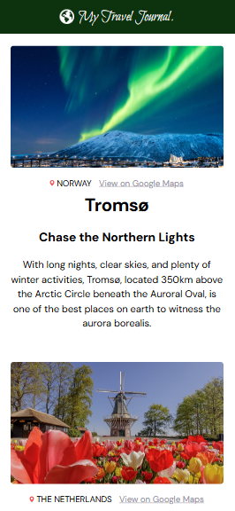

# Travel Journal
Frontend Development, HTML, CSS, JavaScript and React

### Description
A small travel journal web app built with React. The app displays travel destinations dynamically using reusable components and a structured data file. It’s responsive across different screen sizes, thanks to Flexbox and media queries.

This project demonstrates the use of reusable React components, mapping through data and responsive design. It is inspired by a [Scrimba React course](https://scrimba.com/learn-react-c0e) I completed.

### Features
* Reusable components for travel cards, icons and other UI elements. Easily extensible.
* Dynamically renders travel destinations from a centralized data file (*data.js*).
* Each card displays: an image, location (name and country), link to Google Maps, activity suggestion and a text description.
* Responsive layout for mobile, tablets and desktop.

### Tools
* CSS & Flexbox - styling and layout
* React - reusable functional components 

### Screenshots
**Desktop View**

**Mobile View**  

